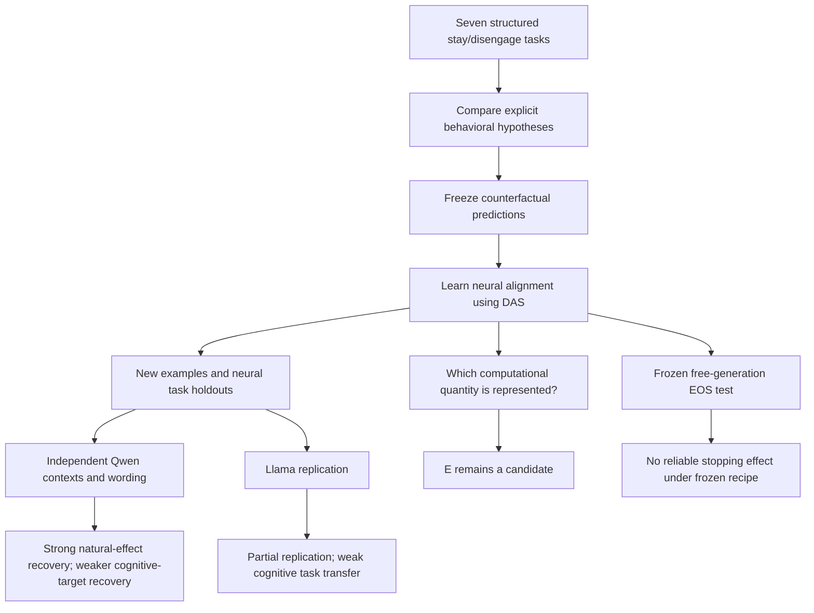
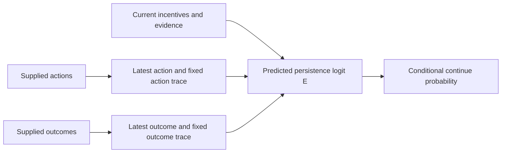
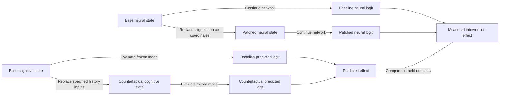

# What the persistence experiments establish

Updated 9 September 2026. This is an explanatory map of completed analyses, not a record that every stage was prospectively planned. It does not launch or queue experiments. Results are drawn from the current manuscript and the Qwen confirmation, Llama mechanistic, and original-study audit reports in this directory.

## The scientific question

Can a cognitive model of stay/disengage decisions specify a computational transformation that helps us discover and test a corresponding neural mechanism?

The intended contribution concerns the relationship between a behavioral explanation and its neural implementation. The dimensionality of a subspace is an implementation detail. A rank-one representation could support a computational explanation, and a higher-rank controller could fail to do so.

The last two branches ask separate questions. The EOS test does not require E to have been identified first, and its negative result does not identify E by elimination.

## What the cognitive model actually contains

The implemented model bank is a set of explicit feature-based operationalizations. It compares current incentives and evidence, action perseveration, outcome history, separate action and outcome histories, and cue-sensitive history, with additional competing accounts. These are useful hypotheses, but their names should not imply that full canonical learning algorithms were fitted.

For a supplied history ending at decision t, the action and outcome traces use fixed lag weights 0.7^k. The most recent action and outcome also enter separately. The decay is stipulated, not discovered as a neural learning rate. Cue-sensitive history combines a context-matched trace with the recent trace using the supplied cue reliability; it falls back to recent history when contextual fields are absent. This is not a demonstrated Bayesian latent-state inference algorithm.

For the retained dual-history account, a schematic logit predictor is:

`E = task-calibrated function(current facts, latest action, action trace, latest outcome, outcome trace)`

The exact preprocessing, missingness indicators, and hierarchical coefficients remain part of the fitted model. The schematic is not a replacement for those details.

This is the **candidate high-level model**, not a diagram of an already established neural circuit. The structured battery measures decisions about described histories; it does not demonstrate that the model updates the same state across an autonomous trajectory.

## The intervention logic

Take a debugging example. Keep the present repair payoff, cost, success estimate, outside option, and previous actions fixed. Replace earlier outcome history with a contrasting history. The frozen cognitive model predicts how much the continue-minus-disengage logit should change.

The neural experiment runs the base and source prompts, takes their final-prompt residual states at a selected layer, and replaces only the base state's coordinates in the learned subspace with the source coordinates. The rest of the base activation is retained. We measure the change in the decision logit.

Two reference effects must stay separate:

- **Cognitive target:** change predicted by the frozen behavioral theory after the specified input replacement.
- **Natural target:** change in the unmodified LLM's output between the controlled base and source prompts.

Both are compared with the same intervention. If the intervention recovers the natural effect but misses the cognitive target, it can be an effective controller while the original theory is miscalibrated. This does not establish that the theory's intermediate variable has been localized.

## Completed experiments and their inferential roles

| Experiment | Result | What follows | What does not follow |
|---|---|---|---|
| Original sequential study, audited stored results | Return decodable; tested return steering near zero; decision steering changes persistence | Decoding alone is insufficient for the tested causal claim | Return information is never causally used |
| Behavioral battery | Qwen pooled R² 0.862, task-macro 0.763; Llama dual-history 0.835 versus immediate-state 0.821 | History-sensitive models predict decisions; Llama gain is modest | A uniquely identified cognitive algorithm or human-like motivation |
| Original Qwen alignment | Primary cognitive recovery 0.968 familiar / 0.873 neural task holdout | A shared low-rank intervention matches selected counterfactuals | Broad generalization: the selected test sets are small and targets have limited variation |
| Five optimization seeds | Mean recovery 0.954 / 0.863 on original sets | Stability at the fixed selected layer/rank | Stability or efficiency of the complete discovery search |
| Broader Qwen contexts | Primary cognitive recovery 0.268 / 0.026; secondary natural recovery 0.894 / 0.871 | Motivates distinguishing theory calibration from natural-effect recovery | A confirmatory natural-effect result: that diagnostic was added during the run |
| Independent Qwen confirmation | Natural recovery 0.779 [0.736, 0.837] / 0.816 [0.790, 0.835]; both exceed 99 random bases | Confirmed causal recovery across the tested contexts, wordings, and neural task holdouts | Unique cognitive identity or superiority over direct behavior-target DAS |
| Same confirmation against frozen theory | Cognitive recovery 0.251 / −0.428; direct DAS natural recovery 0.802 / 0.830 | The discrepancy survives independent testing | Cognitive fitting is the best way to control natural behavior |
| Llama neural replication | Cognitive recovery 0.649 / 0.011; holdout interval spans zero | Partial replication on discovery-task examples | Reliable cognitive-target transfer across task families |
| O/O*/H/E interpretation | E recovery 0.707, but matched-random p=0.667 | E remains a possible descriptive interpretation | Specific evidence identifying E, or exclusion of alternative abstractions |
| Frozen EOS boundary | 1,500 generations; Cox dose −0.0138 [−0.0501, 0.0225]; random p=0.257 | No reliable stopping control from the tested frozen recipe | Proof that no general persistence mechanism exists |

Paired scores are familiar tasks / tasks excluded from neural fitting. Task holdout does not imply that the behavioral theory was fitted without those tasks. Recovery is one minus normalized squared error, not accuracy, percentage mediation, or interchange intervention accuracy. Intervention evaluations are not independent semantic examples; uncertainty must preserve mappings, wording variants, and shared backgrounds.

## The E/EE issue

The code defines O as raw outcome history, O* as context-relevant outcome history, H as the full reference prediction minus its prediction with action/outcome regressors zeroed, and E as the full reference prediction. D is explicitly set equal to E. The implementation uses E; EE in the proposed narrative should be defined as the same quantity if that name is retained.

This means an E interpretation is initially an output-level abstraction. It does not on its own tell us how the model combines history, incentives, and evidence. A more informative claim would distinguish upstream computational alternatives through cases where their intervention predictions disagree. Such a distinction need not produce one neuron per cognitive variable, nor does a valid abstraction have to be unique.

## What should change before spending more compute

1. Put the actual candidate computations and their behavioral comparisons in the main paper. Label the fixed traces and cue weighting accurately.
2. State the high-level intervention, the neural intervention, the tested pair distribution, and the output comparison for every mechanistic claim. Explain that effect matching is the current endpoint.
3. Separate model calibration, intervention fidelity, computational interpretation, and generalization in all result captions.
4. Identify which existing contrasts distinguish theories. The original within-task shuffle does not, because the selected rank-2 targets are constant within task.
5. If a stronger implementation claim remains essential, design one discriminating experiment with predictions fixed for competing computations, including generic decision evidence. Audit existing data first. More repetitions of the same controller score will not answer this question.

The present results support a case study in cognitive-model-guided causal discovery with clear limits. They do not support the original narrative's unqualified positive E identification or a broadly replicated common mechanism.

## Updated discrimination audit

The [CPU audit](computational-discrimination-audit.md) confirms complete evaluation of the declared 280 semantic test contrasts. It also finds predicted O/H effects correlated at 0.975 and 92.5% of E target energy in one family. See the [follow-up specification](computational-discrimination-protocol.md) for a staged test of distinct computational programs. It has not been run.
